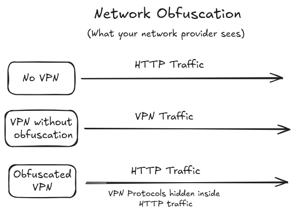
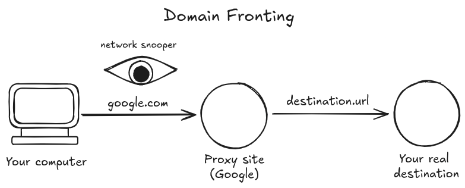

## Background
VPNs are a powerful tool for protecting against online surveillance ranging from governments, Big Tech, ISPs and even everyday hackers. This ability to evade surveillance has been particularly useful in countries like China, where the infamous "Great Firewall" blocks citizens from accessing the open internet. However, as anti-surveillance tools improve, so do the surveillance techniques used to counter them. Around 2012, China started [blocking VPN connections](https://www.theguardian.com/technology/2012/dec/14/china-tightens-great-firewall-internet-control) on its firewall, further isolating its citizens from the global internet. [As nations such as India, Iran, Russia, Syria, Pakistan and Turkey](https://en.wikipedia.org/wiki/VPN_blocking) follow China's lead, obfuscation technologies are becoming essential.

## What is obfuscation?
Obfuscation refers to a set of techniques that VPNs can employ to disguise VPN traffic, so it is indistinguishable from normal web traffic. By wrapping your real, encrypted connection in standard HTTP traffic, your connection becomes far more difficult for firewalls or deep-packet inspection systems to block.

## The Start of Tor Bridges
One of the earliest examples of network obfuscation are "bridges." Bridges emerged from the Tor Project and serve as entry points to the Tor network. In 2007, the project recognized that [censors were beginning to block standard Tor nodes](https://www.torproject.org/about/history/), so they began developing bridges to help users bypass such restrictions.

Bridges are volunteer-run servers and devices that function as gateways into the Tor network. By disguising their traffic as ordinary HTTP requests and keeping most IP addresses undisclosed, they make it harder for censors to block them outright. This approach means that when some bridge IPs are discovered and blocked, many others will remain functional. This allows for new bridges to be spun up and the network remaining accessible. 

Despite these advantages, bridges inherit many of Tor’s drawbacks. In addition to the already slow connection created from Tor's triple-hop architecture, traffic is wrapped in TLS, which adds latency and can further slow down connections.

## Shadowsocks
In 2012, a Chinese programmer named "clowwindy" wished to escape the filter bubble created by China's Firewall. In order to do this, he created a protocol called [Shadowsocks](https://en.wikipedia.org/wiki/Shadowsocks) that connects users to a SOCKS5 proxy and routes their traffic through. One feature that puts Shadowsocks ahead of Tor's bridges is its ability to forward UDP traffic. 

[User Datagram Protocol (UDP) traffic](https://www.cloudflare.com/learning/ddos/glossary/user-datagram-protocol-udp/) is a type of traffic used mainly for tasks that require packets of internet traffic to be sent with low latency, such as playing online games, videoconferencing, or DNS look-ups. This ease of use allowed the technology [to catch on with other Chinese citizens](https://en.greatfire.org/blog/2015/aug/chinese-developers-forced-delete-softwares-police), and Shadowsocks soon became a popular way to connect to the open web in China.

Clowwindy, the developer of Shadowsocks, was eventually forced to [stop working on the project by the police](https://chinadigitaltimes.net/2015/08/circumvention-tool-deleted-after-police-visit-developer/). One of his last comments on GitHub was, "I hope one day I'll live in a country where I have freedom to write any code I like without fearing." Despite clowwindy's contributions only lasting 3 years, his influence lives on in the [many forks and copies of his code](https://www.eff.org/deeplinks/2015/08/speech-enables-speech-china-takes-aim-its-coders) that have been created since his departure.

## meek
Another improvement made to aid in obfuscation is domain-fronting. One of its most common implementations came in the form of [meek](https://www.antitree.com/2014/09/07/meek-protocol/), a protocol that not only blends in with HTTP traffic, but also initializes its connection through google.com and then routes to your requested destination. This protocol was added to Tor in 2016.

[Domain-fronting](https://en.wikipedia.org/wiki/Domain_fronting) masks your traffic by sending it through a "front" domain that acts as a shield, it then forwards the request to the real destination URL. This hides the true endpoint from observers. This method is particularly useful when the first domain is a URL from a service that can be considered "too big to block" such as Google, Microsoft or any other major site. 

## V2Ray
As different obfuscation technologies were created, the need for a central protocol to manage these proxies and network protocols became apparent. This led to the creation of a tool in 2015, called [V2Ray](https://github.com/v2ray/v2ray-core). It was created by [Chinese developer, Victoria Raymond](https://vincentye.com/2021/03/26/circumventing-firewall-v2ray/) and is used to [manage network protocols](https://www.v2ray.com/en/) such as Socks, HTTP and Shadowsocks. Similar to Shadowsocks, the project was created in China and used to circumvent the Great Firewall. Sadly, Victoria Raymond has also disappeared from the internet, leading many to believe that she suffered the same fate as clowwindy and was forced to shut down due to government censorship.

The tool shows the growth of the network obfuscation ecosystem, as it provides a highly customizable experience for power-users. Despite this power, V2Ray still routes traffic through TLS to hide as HTTP, so it suffers from some performance bottlenecks.

## Stealth Protocol
First introduced in 2022 by Proton VPN, the [stealth protocol](https://protonvpn.com/blog/stealth-vpn-protocol/) was created as a more modern implementation of obfuscation protocols. Despite the protocol tunneling TLS over TCP, the system was built to work with their [VPN Accelerator](https://protonvpn.com/features/vpn-accelerator) and be very lightweight, so it can achieve higher speeds than older obfuscation protocols.

## The future of Obfuscation
Looking ahead, we hope to see a wider adoption of obfuscation technology. While it has taken a while for us to get to where we are today, the journey will continue. New technologies such as [Hysteria 2](https://v2.hysteria.network/docs/developers/Protocol/), built on top of QUIC are actively being developed, so we're excited to see what's in store for the future.